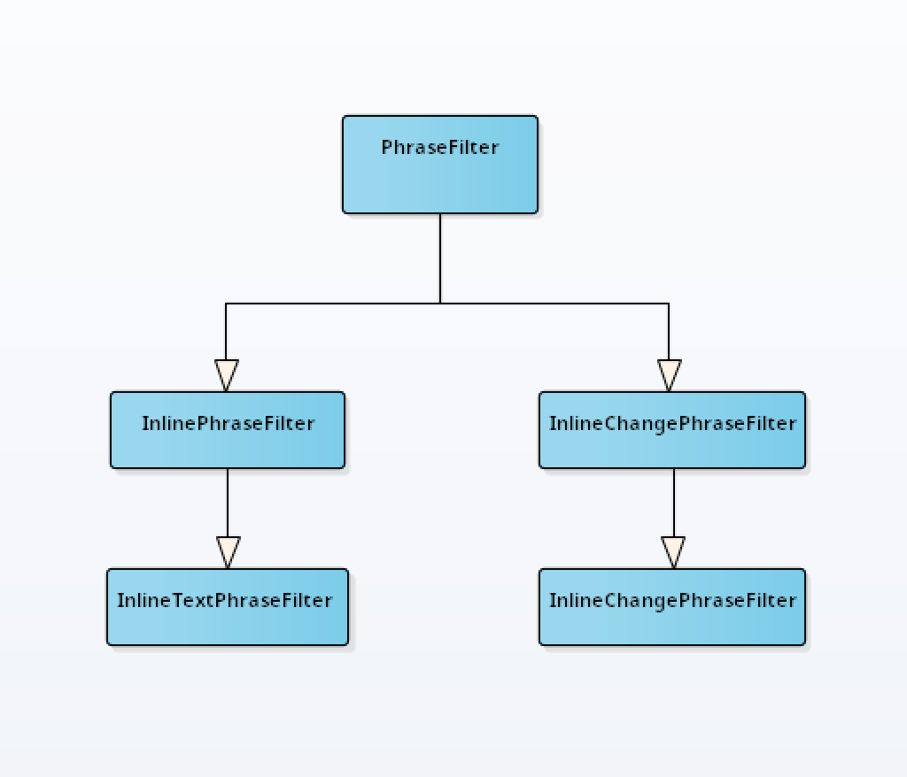

# Dialog-game

This is a demo game, that contains only from dialogs. 
It's created for testing und using `dialog-system` and `dialog-creator`.

For initialisation of dialogs are using scripts file in `./script/`. 

## How to run 

### Gradle

```bash
./gradlew buildDialogAndWorldRouter  // only first start 
./gradlew build 
```

### Game runnner
```kotlin
    val game = Game() // create game object 
    
    Loader(game).load( // load phrases from file 
        "phrases-folder",
        "routers-folder",
        "graphs-folder"
    )
    
    Tester.testGame(game)  // test loaded game     
    val gameRunner = Runner(game, game.world!!) // create runner
    gameRunner.run() // run game
```


## Package `game`

* `Game` - main object
* `GameData` - included all data for Game Work
* `Loader` - create dialogs and phrases from file in a game 
* `Runner` - standard runner for game
* `Tester` - test game data for errors

## Phrases 

The Game uses own `Phrases`, that implement `FilteredPhrase`: 

* `dialog.game.phrases.AutoPhrase` - auto choosing of first `Answer` in a `Phrase`
* `dialog.game.phrases.RandomGamePhrase` - randomly chooses and print one from many textPhrase from a Phrase and 
*  `dialog.game.phrases.AutoPhrase` - implement different logic in dialogs using `PhraseFilter`. Used as default `Phrase` by creating from Script files.
  
  
  
## Phrase Filters

Phrase Filters using for making some action with current Phrase or Game Data. 
Each `PhraseFilter` can be identified in a text by `FilterLabels`, which could be written 
in a text of a `Phrase` or an `Answer`. To use labels, it must be be enclosed in square brackets: 

`some text [label1]  other text`


### Example of using Phrase Filter 

In these phrases used: 
* `SetBooleanFilter` for init and set true boolean value in a `DataGame`  [SET=nameOfvalue]
* `GetBooleanFilter` to read it [GET=nameOfValue]

In the first phrase user could choose one of these answers: 
 * `answer 1`,  this is equals (val ph1 = true). 
 * `answer 2`, variable ph2=true

Depending on users choice, `phrase 2` print different text of phrase.  

```
//phrase 1 
// default class `dialog.game.phrases.AutoPhrase` 
---- phrase1

Text of phrase 1

> [SET=ph1] answer 1 (phrase.2)
> [SET=ph2] answer 2 (phrase.2)

//phrase 2 
---- phrase2

@ [GET=ph1] Print this text, if game variable `ph1` == true 
@ [GET=ph2] Print this text, if game variable `ph2` == true 

>  answer (end #EXIT)
```  

## PhraseFilter Interfaces 

There are many interfaces for different using: 

*  `PhraseFilter` - The common interface, is used for Filtering or Changing `Phrase text` or `Answers` of a Phrase. T
*  `InlinePhraseFilter` - filtering by every element
*  `InlineTextPhraseFilter` - filtering by every element text 
*  `InlineChangePhraseFilter` - changing of every element
*  `InlineChangeTextPhraseFilter` - changing of every element text 
 
Common semantic of PhraseFilters interfaces methods: 

For PhraseFilter : 
```
fun filterPhrasesLogic(phrases: Array<String>, count: Int): Array<String>
fun filterAnswersLogic(answers: Array<Answer>, count: Int): Array<Answer>
```

For Inline [Change]Phrase Filter 
```kotlin
fun filterPhrase(phrase: String, count: Int) : Boolean [Phrase]
fun filterAnswer(answer: Answer, count: Int) : Boolean [Phrase]
```

For Inline [Change] Text Phrase Filter 
```kotlin
fun changeText(itemText: String, count: Int) : Boolean [String]       
```

> here `count` argument is number of running for a phrase of current dialog   

Also all PhraseFilters must override the following attribute for indicate Labels: 
```kotlin
val filterLabelsList: Array<FilterLabel> 
```
If a filter doesn't have any labels or labels are not constant, init it as empty array :
```kotlin
val filterLabelsList: Array<FilterLabel>  = arrayOf()
```




## Add new filter to a Phrase

```kotlin
val phrase = SomePhrase(...);
val filter = new SomeFilter()
FilteredPhraseConfigurator(phrase).addFilter("some filter name", filter, AFilteredPhrase.Order.First)
// or you can choose `Last` order, if you want to set low priority
```

## Auto filter

Class `dialog.game.phrases.filters.phrase.AutoFilter` is a filter, that can automatic recognise registered filters by they labels and run it. 

For registering your filter in Autofilter, use `FilteredPhraseConfigurator`:
```kotlin
val phrase = SomePhrase(...);
val filter = new SomeFilter()
FilteredPhraseConfigurator(phrase)
    .autoFilter() // add auto filter if not exist
    .addAutoFilter(filter);
```

The method `addAutoFilter` take the follow arguments: 
* `filter: PhraseFilter`  - filter 
* `isNeedRebuild: Boolean`  [def = false] -  set true, if filter change hole phrase and needed to restart phrase running.
* `order: AFilteredPhrase.Order` [def = First] - filters Priority  
* `isContain: (label: String) -> Boolean)`- this lambda is used for Recognising Filters labels, if in a filter FilterLabels array is empty (Filters not constant).  


## List of Filters 

| Name | Interface | labels | description | 
| --- | --- | --- |--- |
| AutoFilter | PhraseFilter | - | Recognising and running filters by they filers labels  |
| IfElsePreparingFilterV2 | PhraseFilter | [IF], [ELSE], [ELSEIF], [FI] | implement if-elseif-else conditions |
| InsertFilter | PhraseFilter | [INST=key] | insert answers and text | 
| JoinPhrasesFilter| PhraseFilter | [JOIN] | join all phrases text to one |
| CountFilter | InlineTextPhraseFilter | [1] , [2], [3],...,[*] | select by running cnt, [#] - # running, [*] - else,   |
| DebugFilter | InlineTextPhraseFilter | [DEBUG] | InlineTextPhraseFilter | seen only in debug mode |
| GetBooleanFilter | InlineTextPhraseFilter | [GET=key]| get boolean game variable, return false if not exist |
| GetVariableFilter | InlineTextPhraseFilter | [GETV][key = name]| get game variable, return null if not exisf |
| IfElseFilterV2  | InlineTextPhraseFilter| [IF_SYS], [ELSE_SYS], [ELSEIF_SYS], [FI_SYS] | preparing for if-elseif-else |
| IntComparingFilter  | InlineTextPhraseFilter| [INT][value1>value2] | compared 2 int system variable. support >, <. >=, <=, == , != | 
| IntSimpleArithmeticsFilter | InlineTextPhraseFilter | [[SETI][key+=1]]| implement simple arithmetics operations  |
| RandomFilter | InlineTextPhraseFilter | [RAND], [RAND=key] | select random item. key - separate random groups name |
| SetBooleanFilter | InlineTextPhraseFilter | [SET=key], [UNSET=key]| set boolean as true , false|
| SetValueFilter  | InlineTextPhraseFilter| [SETV][key=value], [UNSETV=key] | set game value , set null  |
| PutFilter | InlineChangePhraseFilter | [PUT=key] | enter text instead label |
| RemoveLabelFilter | InlineChangePhraseFilter | -  | remove all labels from text |


## Game record / replay 

To record and replay game steps you can use 2 Runners: 
* RecordRunner - to record steps. 
* AutoRunner  - to play steps


`RecordRunner` write all answers in a file `resources/game_records` and `AutoRunner` reads this file and plays 
selected record. 

```kotlin
dialog.game.debug.record.2:name of record:world.town.school->town.school.in->plug
dialog.game.debug.record.1:name of secod record:world.startpoint->forest.treehause.in->treehause.dialog.start_dialog->th.start.2
```

## Minigames

Minigames is a simple plugin to game, that could include other Phrases and filters and 
import they in a game. 

For initialisation use `init()` method. 
